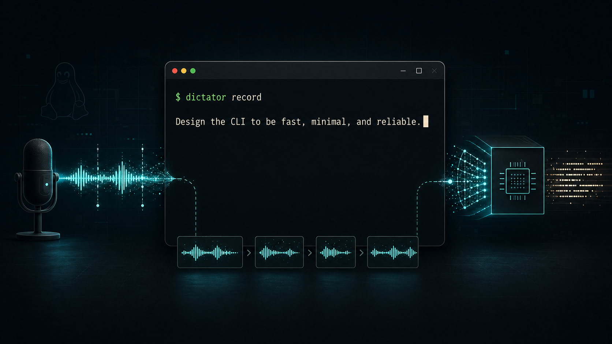

# Dictator

<p align="center">
  
</p>

<p align="center">
  
</p>

Terminal voice-to-text dictation for Linux. Speak and text appears wherever your cursor is.

A background daemon keeps a Whisper model warm in GPU memory. When you start recording, audio is chunked in real-time using Voice Activity Detection (Silero VAD) so transcriptions stream out phrase-by-phrase as you speak, with no waiting for a long recording to finish.

## How it works

```
Your voice → mic → Silero VAD (detects pauses) → Whisper (GPU) → ydotool types into focused window
```

## Requirements

- Linux (tested on Fedora, GNOME Wayland)
- Python 3.11+
- NVIDIA GPU with CUDA (tested with RTX 3090)
- PortAudio: `sudo dnf install portaudio-devel`
- ydotool (for typing into focused window): `sudo dnf install ydotool`

## Install

```bash
pip install -e .
```

## Setup

Start ydotoold (needed for typing text into windows):

```bash
ydotoold &
```

To auto-start ydotoold on login, add to your `.bashrc`:

```bash
pgrep ydotoold || ydotoold &>/dev/null &
```

## Usage

```bash
# Start the daemon (loads Whisper model into GPU memory)
dictator start

# Start recording - switch focus to where you want text, then speak
dictator record

# Ctrl+C to stop recording

# Check daemon status
dictator status

# Stop the daemon (frees GPU memory)
dictator stop
```

## Configuration

Create `~/.config/dictator/config.toml`:

```toml
[audio]
device = "default"          # mic device name
sample_rate = 16000

[whisper]
model = "large-v3"          # tiny | base | small | medium | large-v3
language = "en"             # ISO 639-1 code, or "auto"

[vad]
pause_threshold = 0.7       # seconds of silence before chunking
min_chunk_length = 1.0      # discard segments shorter than this

[output]
mode = "type"               # type | clipboard | stdout
```

### Output modes

- **type** - types text into the focused window via ydotool (default)
- **clipboard** - copies text to clipboard via wl-copy/xclip
- **stdout** - prints to the terminal running `dictator record`

## Architecture

```
┌──────────────────────────────────────────────┐
│              dictator daemon                 │
│                                              │
│  Mic → sounddevice → VAD → Whisper → output  │
│         (queue)    (Silero) (GPU)   (ydotool)│
│                                              │
│  Unix socket server (IPC with CLI)           │
└──────────────────┬───────────────────────────┘
                   │
┌──────────────────┴───────────────────────────┐
│              dictator CLI                    │
│  start | stop | record | status              │
└──────────────────────────────────────────────┘
```

The daemon keeps the Whisper model loaded in VRAM so there's no startup delay when you begin recording. Audio is processed through Silero VAD which detects speech boundaries; when you pause, that chunk is sent to Whisper immediately. Transcriptions appear in under a second.

## Logs and history

- Daemon log: `~/.local/share/dictator/daemon.log`
- Transcription history: `~/.local/share/dictator/history.log`
